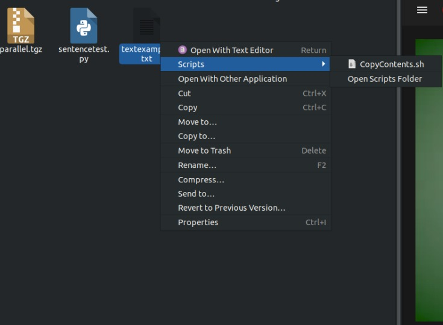
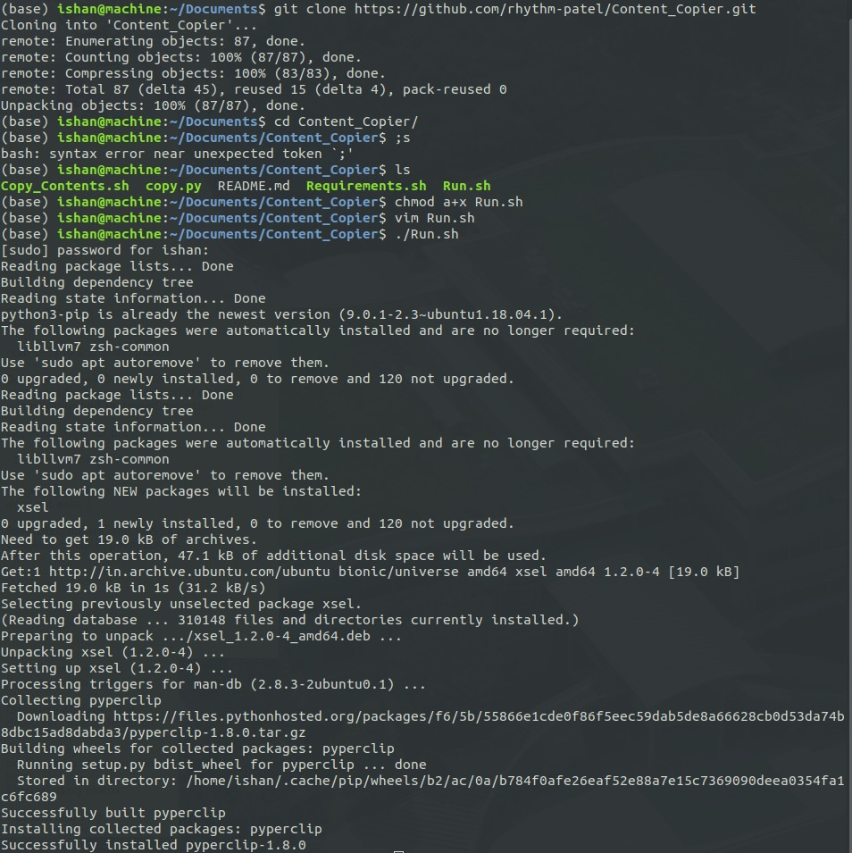

# Content Copier

Copies the content inside a file instead of the file itself. Applicable to any type of file.

**Requirements:** Linux based Operating System with python3 installed

This add-on enables us to copy the data of a file instead of the file being copied itself. 
There are numerous times where we want to copy the content of a file, so we open the file (of any format) with any application (for e.g., say a .java file with VS Code or Eclipse). It takes some time to open the application and then we click on "Select All" and afterwards copy the data. Every time we do this, some time is wasted, and it makes a significant difference when we accumulate this time.

So, with this add-on, after selecting a file, there will be an option to "Copy Content" on the right-click menu. The content of the file is copied, and we save our valuable time.

**Note:** The option to Copy Contents has been moved to the "Scripts" section of the right-click menu from Ubuntu 18 onwards.




## Installation steps

1) Clone this repository
```
git clone https://github.com/rhythm-patel/Content_Copier.git
```
2) Give executable permissions to Run.sh
```
chmod a+x Run.sh
```
3) Run the script file - Run.sh
```
./Run.sh
```

The python modules will be automatically imported, and the scripts will be moved to the necessary locations. The package will get installed and from now onwards, you will have the option to copy content in the right-click menu.



###### This code is contributed to Rhythm Patel and Shubham Mittal.